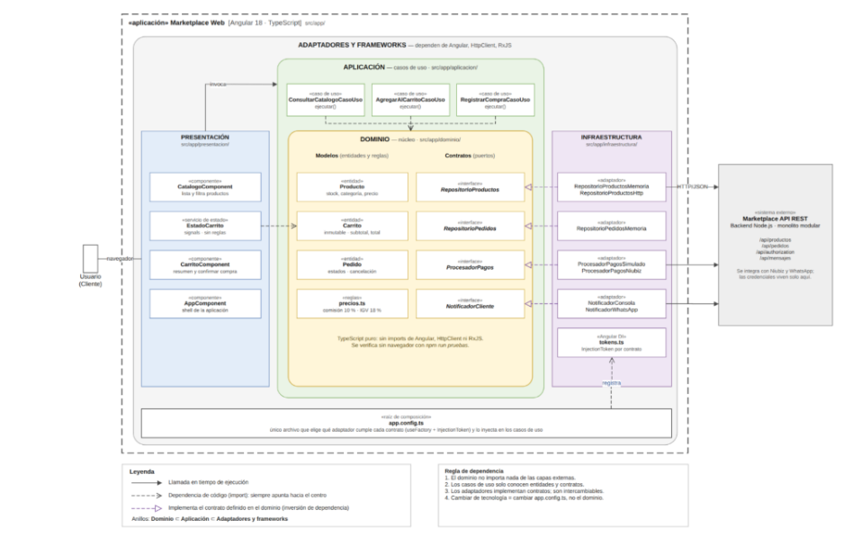

```mermaid
flowchart TB

    %% =========================================================
    %% APLICACIÓN
    %% =========================================================

    subgraph APP["aplicación — Marketplace Web | Angular 18 · TypeScript | src/app/"]

        direction TB

        %% =====================================================
        %% ADAPTADORES Y FRAMEWORKS
        %% =====================================================

        subgraph FRAMEWORKS["ADAPTADORES Y FRAMEWORKS<br/>dependen de Angular, HttpClient, RxJS"]

            direction TB

            %% =================================================
            %% PRESENTACIÓN
            %% =================================================

            subgraph PRESENTACION["PRESENTACIÓN<br/>src/app/presentation/"]

                direction TB

                PRODUCTCOMP["«componente»<br/>CatalogoComponent<br/><br/>lista y filtra productos"]

                CARTSTATE["«servicio de estado»<br/>EstadoCarrito<br/><br/>signals · sin reglas"]

                CARTCOMP["«componente»<br/>CarritoComponent<br/><br/>resume y confirmar compra"]

                APPCOMP["«componente»<br/>AppComponent<br/><br/>shell de la aplicación"]

            end


            %% =================================================
            %% APLICACIÓN - CASOS DE USO
            %% =================================================

            subgraph USECASES["APLICACIÓN — casos de uso<br/>src/app/application/"]

                direction LR

                UC1["«caso de uso»<br/>ConsultarCatalogoCasoUso<br/><br/>ejecutar()"]

                UC2["«caso de uso»<br/>AgregarAlCarritoCasoUso<br/><br/>ejecutar()"]

                UC3["«caso de uso»<br/>RegistrarCompraCasoUso<br/><br/>ejecutar()"]

            end


            %% =================================================
            %% DOMINIO
            %% =================================================

            subgraph DOMINIO["DOMINIO — núcleo<br/>src/app/domain/"]

                direction TB

                subgraph MODELOS["Modelos (entidades y reglas)"]

                    direction LR

                    PRODUCTO["«entidad»<br/>Producto<br/><br/>stock, categoría, precio"]

                    CARRITO["«entidad»<br/>Carrito<br/><br/>inmutable · subtotal, total"]

                    PEDIDO["«entidad»<br/>Pedido<br/><br/>estado · cancelación"]

                    REGLA["«regla»<br/>precios.ts<br/><br/>comisión 10% · IGV 18%"]

                end


                subgraph PUERTOS["Contratos (puertos)"]

                    direction LR

                    REPO_PRODUCTOS["«interface»<br/>RepositorioProductos"]

                    REPO_PEDIDOS["«interface»<br/>RepositorioPedidos"]

                    PAGO["«interface»<br/>ProcesadorPagos"]

                    NOTIFICADOR["«interface»<br/>NotificadorCliente"]

                end

            end


            %% =================================================
            %% INFRAESTRUCTURA
            %% =================================================

            subgraph INFRA["INFRAESTRUCTURA<br/>src/app/infrastructure/"]

                direction TB

                ADAPT_PRODUCTOS["«adaptador»<br/>RepositorioProductosMemoria<br/>RepositorioProductosHttp"]

                ADAPT_PEDIDOS["«adaptador»<br/>RepositorioPedidosMemoria"]

                ADAPT_PAGO["«adaptador»<br/>ProcesadorPagoSimulado<br/>ProcesadorPagosNiubiz"]

                ADAPT_NOTIF["«adaptador»<br/>NotificadorConsola<br/>NotificadorWhatsApp"]

                DI["«Angular DI»<br/>tokens.ts<br/><br/>InjectionToken por contrato"]

            end


            %% =================================================
            %% REGLA DE COMPOSICIÓN
            %% =================================================

            COMPOSITION["«raíz de composición»<br/>app.config.ts<br/><br/>único archivo que elige qué adaptador cumple cada contrato<br/>(useFactory + injectionToken) y lo inyecta en los casos de uso"]


            %% =================================================
            %% NOTA DEL DOMINIO
            %% =================================================

            DOMAINNOTE["TypeScript puro: sin imports de Angular, HttpClient ni RxJS.<br/>Se verifica sin navegador con npm run pruebas."]

        end

    end


    %% =========================================================
    %% SISTEMA EXTERNO
    %% =========================================================

    EXTERNAL["«sistema externo»<br/>Marketplace API REST<br/>Backend Node.js · monolito modular<br/><br/>/api/productos<br/>/api/autorizacion<br/>/api/usuarios<br/><br/>Se integra con Niubiz y WhatsApp:<br/>las credenciales viven solo aquí."]


    %% =========================================================
    %% USUARIO
    %% =========================================================

    USER["Usuario<br/>(Cliente)"]


    %% =========================================================
    %% FLUJOS DE EJECUCIÓN
    %% =========================================================

    USER -->|"navegador"| APPCOMP

    APPCOMP --> PRODUCTCOMP

    PRODUCTCOMP -->|"invoca"| UC1
    CARTCOMP --> UC2
    CARTCOMP --> UC3

    UC1 --> PRODUCTO
    UC2 --> CARRITO
    UC3 --> PEDIDO

    UC1 --> REPO_PRODUCTOS
    UC2 --> REPO_PRODUCTOS
    UC3 --> REPO_PEDIDOS

    UC3 --> PAGO
    UC3 --> NOTIFICADOR


    %% =========================================================
    %% DEPENDENCIAS DE CÓDIGO — HACIA EL CENTRO
    %% =========================================================

    REPO_PRODUCTOS -.->|"dependencia de código (import)<br/>siempre apunta hacia el centro"| ADAPT_PRODUCTOS
    REPO_PEDIDOS -.->|"dependencia de código (import)<br/>siempre apunta hacia el centro"| ADAPT_PEDIDOS
    PAGO -.-> ADAPT_PAGO
    NOTIFICADOR -.-> ADAPT_NOTIF

    %% Adaptadores implementan contratos
    ADAPT_PRODUCTOS -.->|"implementa"| REPO_PRODUCTOS
    ADAPT_PEDIDOS -.->|"implementa"| REPO_PEDIDOS
    ADAPT_PAGO -.->|"implementa"| PAGO
    ADAPT_NOTIF -.->|"implementa"| NOTIFICADOR


    %% =========================================================
    %% INFRAESTRUCTURA -> API EXTERNA
    %% =========================================================

    ADAPT_PRODUCTOS -->|"HTTP / JSON"| EXTERNAL
    ADAPT_PEDIDOS -->|"HTTP / JSON"| EXTERNAL
    ADAPT_PAGO -->|"HTTP / JSON"| EXTERNAL
    ADAPT_NOTIF -->|"HTTP / JSON"| EXTERNAL


    %% =========================================================
    %% DEPENDENCY INJECTION
    %% =========================================================

    COMPOSITION -.->|"registra"| DI

    DI -.->|"InjectionToken"| ADAPT_PRODUCTOS
    DI -.->|"InjectionToken"| ADAPT_PEDIDOS
    DI -.->|"InjectionToken"| ADAPT_PAGO
    DI -.->|"InjectionToken"| ADAPT_NOTIF


    %% =========================================================
    %% ESTADO DEL CARRITO
    %% =========================================================

    CARTCOMP --> CARTSTATE
    CARTSTATE --> CARRITO


    %% =========================================================
    %% ESTILOS
    %% =========================================================

    classDef user fill:#ffffff,stroke:#777,color:#333
    classDef presentation fill:#dce9f8,stroke:#8caed1,color:#333
    classDef application fill:#e5f2df,stroke:#91b77e,color:#333
    classDef domain fill:#fff0c9,stroke:#d7ae50,color:#333
    classDef infrastructure fill:#eadcf0,stroke:#b48cc6,color:#333
    classDef external fill:#eeeeee,stroke:#777,color:#333
    classDef composition fill:#ffffff,stroke:#777,color:#333
    classDef note fill:#fff8dc,stroke:#c8a951,color:#333

    class USER user
    class PRODUCTCOMP,CARTSTATE,CARTCOMP,APPCOMP presentation
    class UC1,UC2,UC3 application
    class PRODUCTO,CARRITO,PEDIDO,REGLA,REPO_PRODUCTOS,REPO_PEDIDOS,PAGO,NOTIFICADOR domain
    class ADAPT_PRODUCTOS,ADAPT_PEDIDOS,ADAPT_PAGO,ADAPT_NOTIF,DI infrastructure
    class EXTERNAL external
    class COMPOSITION composition
    class DOMAINNOTE note
```

