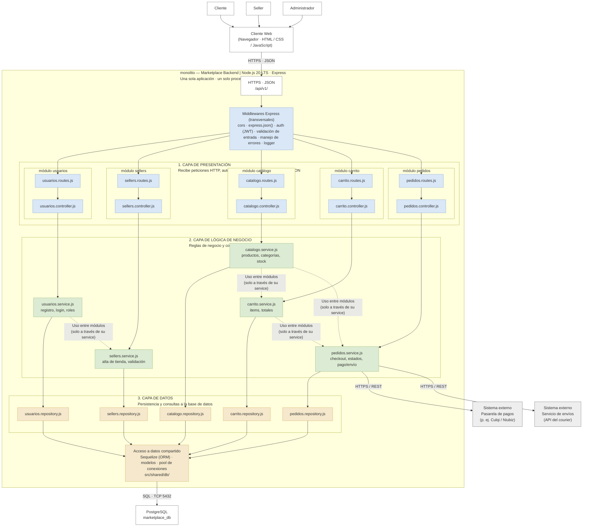
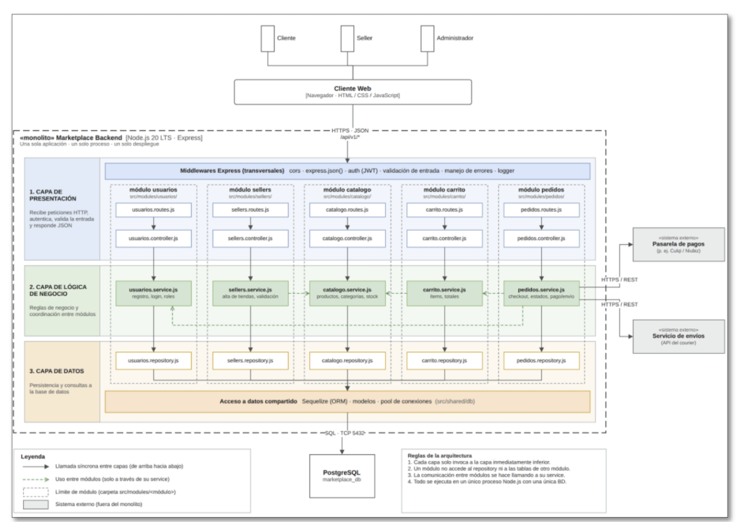

```mermaid
flowchart TB

    %% =========================================================
    %% ACTORES Y CLIENTE WEB
    %% =========================================================

    Cliente["Cliente"]
    Seller["Seller"]
    Admin["Administrador"]

    Web["Cliente Web<br/>(Navegador · HTML / CSS / JavaScript)"]

    Cliente --> Web
    Seller --> Web
    Admin --> Web


    %% =========================================================
    %% MONOLITO BACKEND
    %% =========================================================

    subgraph BACKEND["monolito — Marketplace Backend | Node.js 20 LTS · Express<br/>Una sola aplicación · un solo proceso · un solo despliegue"]

        direction TB

        API["HTTPS · JSON<br/>/api/v1/"]

        %% -----------------------------------------------------
        %% CAPA 1 - PRESENTACIÓN
        %% -----------------------------------------------------

        subgraph PRESENTACION["1. CAPA DE PRESENTACIÓN<br/>Recibe peticiones HTTP, autentica, valida la entrada y responde JSON"]

            direction LR

            subgraph USUARIOS["módulo usuarios<br/>src/modules/usuarios/"]
                UROUTES["usuarios.routes.js"]
                UCONTROLLER["usuarios.controller.js"]
                UROUTES --> UCONTROLLER
            end

            subgraph SELLERS["módulo sellers<br/>src/modules/sellers/"]
                SROUTES["sellers.routes.js"]
                SCONTROLLER["sellers.controller.js"]
                SROUTES --> SCONTROLLER
            end

            subgraph CATALOGO["módulo catálogo<br/>src/modules/catalogo/"]
                CROUTES["catalogo.routes.js"]
                CCONTROLLER["catalogo.controller.js"]
                CROUTES --> CCONTROLLER
            end

            subgraph CARRITO["módulo carrito<br/>src/modules/carrito/"]
                CARROUTES["carrito.routes.js"]
                CARCONTROLLER["carrito.controller.js"]
                CARROUTES --> CARCONTROLLER
            end

            subgraph PEDIDOS["módulo pedidos<br/>src/modules/pedidos/"]
                PROUTES["pedidos.routes.js"]
                PCONTROLLER["pedidos.controller.js"]
                PROUTES --> PCONTROLLER
            end
        end


        %% -----------------------------------------------------
        %% MIDDLEWARES
        %% -----------------------------------------------------

        MIDDLEWARES["Middlewares Express (transversales)<br/>cors · express.json() · auth (JWT) · validación de entrada · manejo de errores · logger"]


        %% -----------------------------------------------------
        %% CAPA 2 - NEGOCIO
        %% -----------------------------------------------------

        subgraph NEGOCIO["2. CAPA DE LÓGICA DE NEGOCIO<br/>Reglas de negocio y coordinación entre módulos"]

            direction LR

            USERSERVICE["usuarios.service.js<br/>registro, login, roles"]

            SELLSERVICE["sellers.service.js<br/>alta de tienda, validación"]

            CATSERVICE["catalogo.service.js<br/>productos, categorías, stock"]

            CARTSERVICE["carrito.service.js<br/>items, totales"]

            ORDERSERVICE["pedidos.service.js<br/>checkout, estados, pago/envío"]
        end


        %% -----------------------------------------------------
        %% CAPA 3 - DATOS
        %% -----------------------------------------------------

        subgraph DATOS["3. CAPA DE DATOS<br/>Persistencia y consultas a la base de datos"]

            direction LR

            UREPO["usuarios.repository.js"]
            SREPO["sellers.repository.js"]
            CREPO["catalogo.repository.js"]
            CARREPO["carrito.repository.js"]
            PREPO["pedidos.repository.js"]
        end


        %% -----------------------------------------------------
        %% ACCESO A DATOS COMPARTIDO
        %% -----------------------------------------------------

        SHARED["Acceso a datos compartido<br/>Sequelize (ORM) · modelos · pool de conexiones<br/>src/shared/db/"]


        %% -----------------------------------------------------
        %% FLUJO ENTRE CAPAS
        %% -----------------------------------------------------

        API --> MIDDLEWARES

        MIDDLEWARES --> UROUTES
        MIDDLEWARES --> SROUTES
        MIDDLEWARES --> CROUTES
        MIDDLEWARES --> CARROUTES
        MIDDLEWARES --> PROUTES

        UCONTROLLER --> USERSERVICE
        SCONTROLLER --> SELLSERVICE
        CCONTROLLER --> CATSERVICE
        CARCONTROLLER --> CARTSERVICE
        PCONTROLLER --> ORDERSERVICE

        USERSERVICE --> UREPO
        SELLSERVICE --> SREPO
        CATSERVICE --> CREPO
        CARTSERVICE --> CARREPO
        ORDERSERVICE --> PREPO

        UREPO --> SHARED
        SREPO --> SHARED
        CREPO --> SHARED
        CARREPO --> SHARED
        PREPO --> SHARED

    end


    %% =========================================================
    %% SISTEMAS EXTERNOS
    %% =========================================================

    PAYMENT["Sistema externo<br/>Pasarela de pagos<br/>(p. ej. Culqi / Niubiz)"]

    SHIPPING["Sistema externo<br/>Servicio de envíos<br/>(API del courier)"]

    DB["PostgreSQL<br/>marketplace_db"]


    %% =========================================================
    %% CONEXIONES EXTERNAS
    %% =========================================================

    Web -->|"HTTPS · JSON"| API

    ORDERSERVICE -->|"HTTPS / REST"| PAYMENT
    ORDERSERVICE -->|"HTTPS / REST"| SHIPPING

    SHARED -->|"SQL · TCP 5432"| DB


    %% =========================================================
    %% COMUNICACIÓN ENTRE MÓDULOS
    %% =========================================================

    USERSERVICE -.->|"Uso entre módulos<br/>(solo a través de su service)"| SELLSERVICE
    CATSERVICE -.->|"Uso entre módulos<br/>(solo a través de su service)"| CARTSERVICE
    CATSERVICE -.->|"Uso entre módulos<br/>(solo a través de su service)"| ORDERSERVICE
    CARTSERVICE -.->|"Uso entre módulos<br/>(solo a través de su service)"| ORDERSERVICE


    %% =========================================================
    %% ESTILOS
    %% =========================================================

    classDef actor fill:#ffffff,stroke:#777,color:#333
    classDef web fill:#ffffff,stroke:#777,color:#333
    classDef middleware fill:#d9e7f7,stroke:#8aa9cc,color:#333
    classDef presentation fill:#d9e7f7,stroke:#8aa9cc,color:#333
    classDef business fill:#dcebd3,stroke:#91b879,color:#333
    classDef data fill:#f5e8cc,stroke:#d6ae63,color:#333
    classDef shared fill:#f5e8cc,stroke:#d6ae63,color:#333
    classDef external fill:#eeeeee,stroke:#777,color:#333
    classDef database fill:#ffffff,stroke:#777,color:#333
    classDef api fill:#ffffff,stroke:#777,color:#333

    class Cliente,Seller,Admin actor
    class Web web
    class API api
    class MIDDLEWARES middleware

    class UROUTES,UCONTROLLER,SROUTES,SCONTROLLER,CROUTES,CCONTROLLER,CARROUTES,CARCONTROLLER,PROUTES,PCONTROLLER presentation

    class USERSERVICE,SELLSERVICE,CATSERVICE,CARTSERVICE,ORDERSERVICE business

    class UREPO,SREPO,CREPO,CARREPO,PREPO data
    class SHARED shared

    class PAYMENT,SHIPPING external
    class DB database
```

